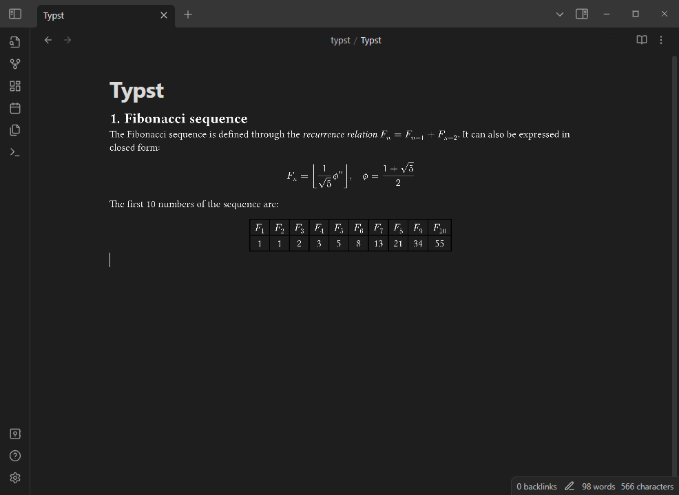

# Typst Renderer

Renders `typst` code blocks, and optionally math blocks, into images using [Typst](https://github.com/typst/typst) through the power of WASM! This is still very much in development, so suggestions and bugs are welcome!

## Small Things to NOTE
- Typst does not currently support exporting to HTML only PDFs, PNGs and SVGs. So due to image scaling, the rendered views may look a bit terrible. If you know how to fix this PLEASE HELP.
- File paths should be relative to the vault folder.
- To help with loading times the web assembly file must be downloaded separately. This will automatically happen the first time the plugin is enabled and after an update!

## Versions

| Plugin | Typst |
|-|-|
| 0.10 | 0.11.0 |
| 0.9 | 0.10.0 |
| 0.8 | 0.9.0 |
| 0.7 | 0.8.0 |
| 0.6 | [522708b](https://github.com/typst/typst/commit/522708b9df0b9b2f8265938aa1f0aeda8e6e6c1f) (Some commits after 0.7.0 to include SVG export) |
| 0.5 | 0.6.0 |
| 0.4 | 0.3.0 |
| 0.3 | 0.2.0 |

## Using Packages
On desktop the plugin supports reading packages from the [`@preview`](https://github.com/typst/packages#downloads) and [`@local`](https://github.com/typst/packages#local-packages) namespaces. If a package cannot be found in either folder and the "Download Missing Packages" setting is on, the package will be downloaded and saved within the current vault in the pulgin's folder. 

On mobile only the `@preview` namespace is supported and will always download missing packages to the vault.

You can view the downloaded packages in the settings and choose which ones to delete.

## Math Block Usage
The plugin can render `typst` inside math blocks! By default this is off, to enable it set the "Override Math Blocks" setting or use the "Toggle math block override" command. Math block types are conserved between Obsidian and Typst, `$...$` -> `$...$` and `$$...$$` -> `$ ... $`.

From what I've experimented with, normal math blocks are okay with Typst but Typst is not happy with any Latex code.

For styling and using imports with math blocks see the next section.

## Preambles

Need to style your `typst` code the same way everytime and don't to write it out each time? Or using math blocks and need a way to import things? Use PREAMBLES!

Preambles are prepended to your `typst` code before compiling. There are three different types on the "Typst Renderer" plugin settings page:
- `shared`: Prepended to all `typst` code.
- `math`: Prepended to `typst` code only in math blocks.
- `code`: Prepended to `typst` code only in code blocks.

The following variables are defined for you in all preambles to help style the output correctly:
- `WIDTH`: The horizontal size of the space the output will be placed in. Can be a `length` or `auto` if the space is not limited in that direction.
- `HEIGHT`: The vertical size of the space the output will be placed in. Can be a `length` or `auto` if the space is not limited in that direction.
- `SIZE`: The font size as defined by the CSS property `"--font-text-size"`
- `THEME`: A string defining the current theme of Obsidian. Either "light" or "dark".

The following are the default preambles, I highly recommend you check this on each update to make sure you don't miss any changes that could break things. That being said you don't need them they are merely recommended.
<details>
<summary>Shared</summary>

```
#set text(fill: white, size: SIZE)
#set page(width: WIDTH, height: HEIGHT)
```
</details>
<details>
<summary>Math</summary>

```
#set page(margin: 0pt)
#set align(horizon)
```
</details>
<details>
<summary>Code</summary>

```
#set page(margin: (y: 1em, x: 0pt))
```
</details>

## Known Issues
### Runtime Error Unreachable or Recursive Use Of Object
These occur when the Typst compiler panics for any reason and means the compiler cannot be used again until it is restarted. There should be more information in the console log so please create an issue with this error!

## Example

```
```typst
= Fibonacci sequence
The Fibonacci sequence is defined through the
_recurrence relation_ $F_n = F_(n-1) + F_(n-2)$.
It can also be expressed in closed form:

$ F_n = floor(1 / sqrt(5) phi.alt^n), quad
  phi.alt = (1 + sqrt(5)) / 2 $

#let count = 10
#let nums = range(1, count + 1)
#let fib(n) = (
  if n <= 2 { 1 }
  else { fib(n - 1) + fib(n - 2) }
)

The first #count numbers of the sequence are:

#align(center, table(
  columns: count,
  ..nums.map(n => $F_#n$),
  ..nums.map(n => str(fib(n))),
))

```​
```



## Installation
Install "Typst Renderer" from the community plugins tab in settings

or 

Install it by copying `main.js`, `styles.css`, `obsidian_typst_bg.wasm` and `manifest.json` from the releases tab to the folder `.obsidian/plugins/typst` in your vault.

## TODO / Goals (In no particular order)
- [x] Better font loading
- [x] Fix importing
- [x] Fix Github Actions
- [x] Better error handling
- [x] ? Fix output image scaling
- [ ] Use HTML output
- [x] Override default equation rendering
- [ ] Custom editor for `.typ` files
- [x] Mobile file reading
- [x] Automate package downloading
- [ ] Use `sys.stdin` for preambles instead of modifying the source cod
- [ ] Overhall plugin structure (mostly communication with the webworker)
